# Relatório Técnico – Métodos de Estudo Eficazes

**Grupo:** inf24tig07  
**Repositório GitHub:** [https://github.com/inf24tig07/trabalho-final](https://github.com/inf24tig07/trabalho-final)  


---

## 1. Project Presentation – Apresentação do Projeto

## Tema: Ensino
## Proposta de Trabalho

O presente projeto tem como objetivo o desenvolvimento de um website informativo, composto por **pelo menos quatro páginas estáticas, subordinado ao tema "Ensino"**, recorrendo às tecnologias **HTML5, CSS3 e JavaScript**.

Pretende-se apresentar conteúdos relevantes sobre métodos de ensino, recursos educativos, curiosidades e contactos, de forma clara, acessível e esteticamente apelativa. Para além dos requisitos mínimos definidos no enunciado, procurou-se aplicar boas práticas de semântica, acessibilidade, validação de código e experiência de utilizador.

## Descrição Geral do Projeto

O projeto resulta na construção de um website informativo destinado a alunos, professores ou qualquer utilizador interessado em aprender mais sobre educação. As páginas criadas estão interligadas entre si através de um menu de navegação acessível e responsivo.

 ## As páginas principais são:

 **Página Inicial (index.html)** – Introdução ao tema, apresentação do site e acesso aos principais conteúdos.

**Curiosidades sobre o Ensino (Curiosidadesensino.html)** – Conteúdo informativo e curioso sobre o mundo da educação.

**Métodos de Ensino (metodos.html)** – Apresentação de diferentes abordagens pedagógicas com destaque para as mais atuais.

**Recursos Educativos (recursos.html)** – Sugestões de materiais e ferramentas úteis para o ensino.

**Página de Contacto (contacto.html)** – Formulário para contacto e informações da equipa.

O projeto foi desenvolvido com base nos princípios da web estática, sem qualquer uso de tecnologias server-side ou bases de dados, respeitando os limites definidos no enunciado. No entanto, foram incluídas animações, responsividade e scripts em JavaScript para enriquecer a experiência do utilizador.

## Objetivos do Projeto
Cumprir todos os requisitos técnicos especificados no enunciado;

Desenvolver um produto final funcional, intuitivo e apelativo;

Utilizar corretamente HTML semântico e CSS moderno;

Aplicar JavaScript para melhorar a interatividade;

Validar o código utilizando os validadores da W3C;

Publicar o projeto online através do serviço **Netlify**;

Elaborar um relatório técnico detalhado sobre o processo de desenvolvimento.

---

## 2. User Interface – Interface com o Utilizador

A interface do website “**Métodos de Estudo Eficazes**” foi planeada com foco na clareza, simplicidade e acessibilidade, assegurando uma navegação fluída e agradável para qualquer utilizador. Para tal, foram desenvolvidos **wireframes** representativos de cada página, bem como um **sitemap** que ilustra a estrutura hierárquica do site.

### :pushpin: Estudo da Interface: Wireframes

Foram elaborados wireframes para as seguintes páginas principais:

- **Página Inicial**  
  Contém uma introdução ao tema, uma lista de métodos de estudo mais usados (com fundo creme) e uma secção com passos para estudar de forma eficaz (com fundo azul claro).


  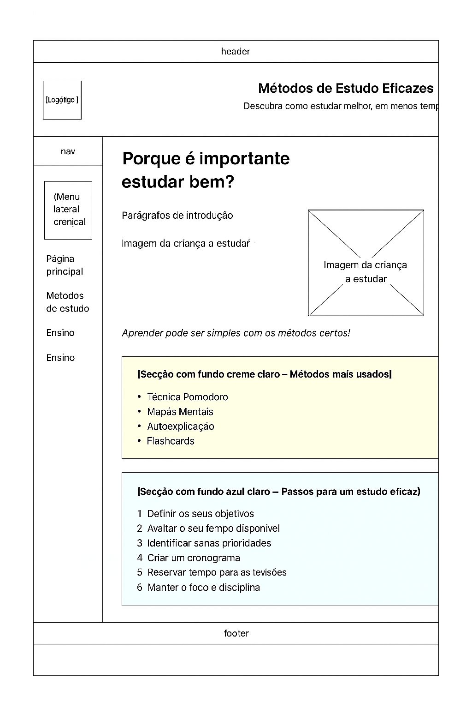
  

- **Métodos de Estudo**  
  Apresenta uma tabela comparativa com colunas: `Método`, `Descrição`, `Vantagens`, `Desvantagens` e `Ideal para`. Inclui também uma dica em destaque.

  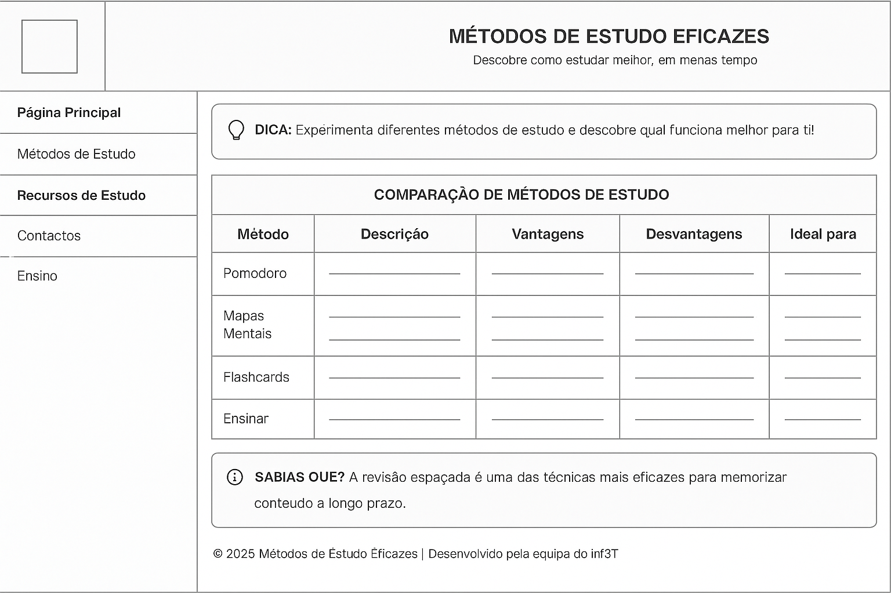

- **Recursos de Estudo**  
  Divide-se em três secções:  
  - Recursos e aplicações úteis (lista simples)  
  - Dicas de estudo (vídeo)  
  - Técnicas e definições (texto explicativo)  
  Além disso, mostra os métodos carregados dinamicamente a partir de um ficheiro XML.

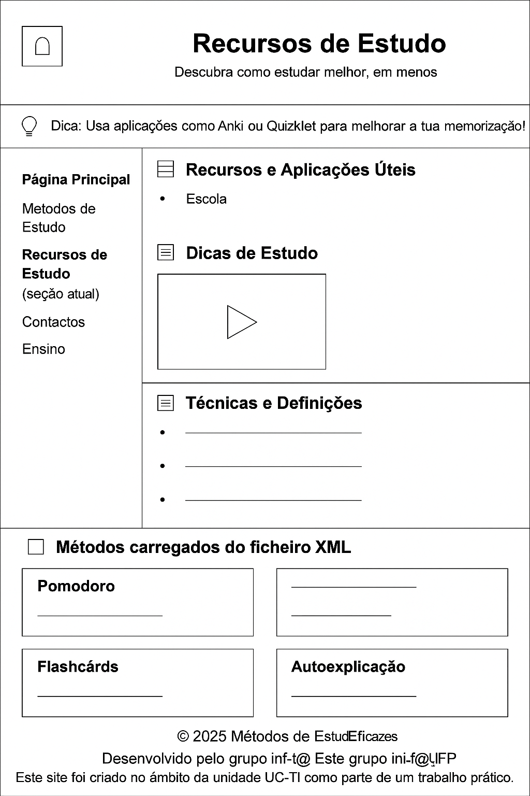


- **Página de Contacto**  
  Formulário com campos de nome, email, seleção de métodos preferidos, textarea para mensagem com limite de 200 palavras, e dois botões: `Enviar` e `Descarregar fórmulas úteis`.


  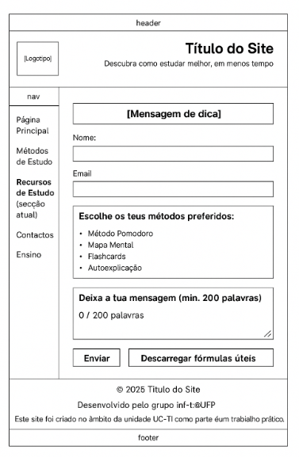

- **Curiosidades sobre o Ensino (Ensino)**  
  Mostra curiosidades de diferentes países  com botões visuais e mensagens motivacionais.

  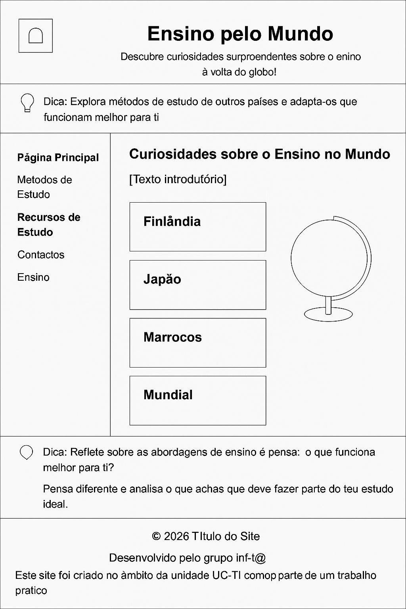


- **Menu de Navegação (comum a todas as páginas)**  
  Inclui:  
  - Página Principal  
  - Métodos de Estudo  
  - Recursos de Estudo  
  - Contactos  
  - Ensino

Cada página foi verificada e corresponde fielmente ao respetivo wireframe.

---

### 🗺️ Estrutura do Site: Sitemap

A hierarquia do site foi representada no seguinte **sitemap**, onde se demonstra a relação entre as páginas principais e as suas subsecções:


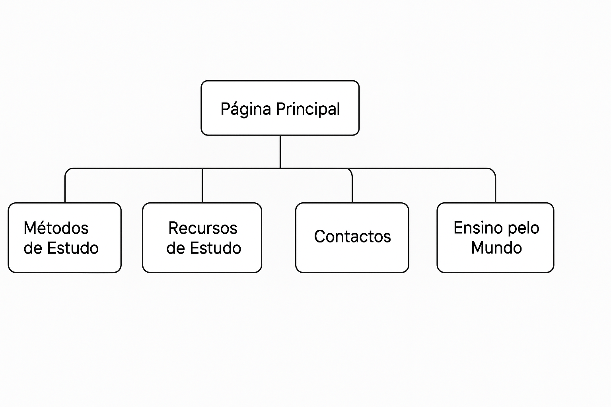


---


### Comparação entre o Estudo Inicial e o Produto Final

Todos os wireframes desenvolvidos foram respeitados na implementação do website. As páginas finais correspondem integralmente à estrutura prevista, tanto a nível de conteúdo como de organização visual.

| Página                  | Cumprimento do Planeamento | Observações |
|------------------------|-----------------------------|-------------|
| Página Inicial         | ✅ Sim                      | Seguiu exatamente o layout com introdução, métodos usados e passos para estudar bem. |
| Métodos de Estudo      | ✅ Sim                      | A tabela comparativa foi fiel ao wireframe com as 5 colunas. |
| Recursos de Estudo     | ✅ Sim                      | A divisão por secções (recursos, vídeo, definições, XML) foi mantida. |
| Contacto               | ✅ Sim                      | Todos os elementos do formulário e botões foram incluídos como planeado. |
| Curiosidades/Ensino    | ✅ Sim                      | Os países e as dicas aparecem tal como definido nos wireframes. |
| Menu de Navegação      | ✅ Sim                      | Consistência assegurada em todas as páginas. |

A navegação é intuitiva e coerente em todas as páginas, e os estilos aplicados garantem uma experiência de utilizador semelhante à que foi desenhada na fase de prototipagem.

Além disso, o sitemap manteve-se inalterado, confirmando que o produto final respeitou a hierarquia e o planeamento inicial do projeto.


---


## 3. Product – Produto

O website “**Métodos de Estudo Eficazes**” foi desenvolvido com recurso a HTML5, CSS3 e JavaScript. Este produto final tem como objetivo proporcionar aos utilizadores uma navegação simples e agradável, ao mesmo tempo que oferece conteúdo educativo útil e interativo. Está publicado online e cumpre todos os requisitos técnicos definidos no enunciado da unidade curricular.

---

### 🌐 Ligação para o site do grupo em Netlify

🔗 [https://metodosdeestudoeficazes.netlify.app](https://metodosdeestudoeficazes.netlify.app)

---

### 🛠️ Instruções de Instalação e Configuração

#### ✔️ Instalação Local

1. Acede ao repositório do projeto no GitHub:  
   [https://github.com/inf24tig07/trabalho-final](https://github.com/inf24tig07/trabalho-final)

2. Clica em **"Code" > "Download ZIP"** ou utiliza o seguinte comando Git:

   ```bash
   git clone https://github.com/inf24tig07/trabalho-final.git


3. Extrai os ficheiros do .zip (caso aplicável).

4. Abre o ficheiro index.html com um navegador à tua escolha.
   

---


#### ✔️ Instalação no Netlify (Publicação Automática)

1. Cria uma conta gratuita em [https://www.netlify.com](https://www.netlify.com)

2. Liga a tua conta do Netlify ao GitHub.

3. Escolhe o repositório `inf24tig07/trabalho-final`.

4. Configura a publicação automática com os seguintes parâmetros:

   - **Build command**: *(deixar vazio – o projeto é estático)*
   - **Publish directory**: `/`

5. Clica em **Deploy**.

6. Após a publicação, copia o link gerado para acesso público ao site.

---

### 🔐 Regras de Utilização

- O site é **público** e **gratuito**.
- Não exige qualquer tipo de login ou autenticação.
- Não recolhe nem guarda dados pessoais dos utilizadores.

---

### 🧭 Ajuda à Navegação

- A navegação é feita através de um **menu lateral fixo**, disponível em todas as páginas.
- Os seguintes itens estão sempre acessíveis:
  - Página Principal
  - Métodos de Estudo
  - Recursos de Estudo
  - Contactos
  - Ensino

#### Elementos visuais de apoio incluídos:

- Tooltips nos botões e ícones.
- Cores diferenciadas por tipo de conteúdo (ex: azul para passos, creme para métodos).
- Estrutura clara com títulos, listas e tabelas organizadas.
- Secção ativa destacada no menu.

---

### ✅ Validações de Formulários

O formulário de contacto inclui:

- Campo de texto para **Nome**
- Campo de **Email** (com validação automática do tipo email)
- Caixa de seleção de **métodos preferidos**
- Área de texto limitada a **200 palavras**, com **contador dinâmico**
- Botões de **"Enviar"** e **"Descarregar fórmulas úteis"**

Validações JavaScript implementadas:

- Verificação de campos obrigatórios preenchidos
- Validação do formato de email
- Contador e limite de palavras para a textarea

---

### 🔎 Validação do HTML e CSS

#### Ferramentas utilizadas:

- [HTML Validator – W3C](https://validator.w3.org)
- [CSS Validator – W3C](https://jigsaw.w3.org/css-validator)

#### Resultados:

- Todos os ficheiros HTML e CSS foram validados com sucesso, **sem erros**.
- Foram corrigidos pequenos *warnings* relacionados com boas práticas semânticas.

#### Capturas de ecrã da validação HTML:

- 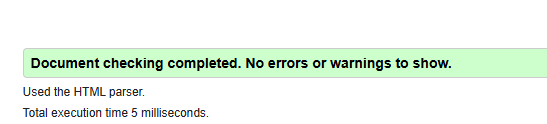
- 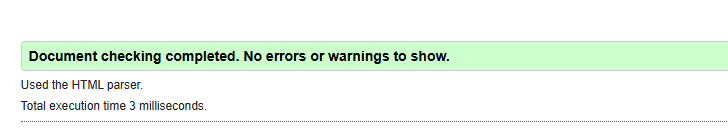
- 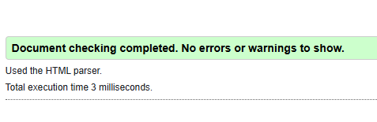
- 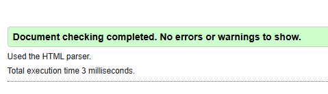
- 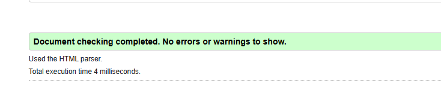

---

### ⚙️ Detalhes de Implementação

O site cumpre todos os requisitos mínimos do enunciado. Cada página foi desenvolvida com:

- Estrutura semântica **HTML**
- Estilos externos **CSS** organizados e reutilizáveis
- Scripts em **JavaScript** para interatividade
- **Design responsivo** e compatível com diferentes ecrãs
- Conteúdo separado em **secções bem definidas**
- Foco na **legibilidade e usabilidade**
- Publicação online realizada com sucesso através da integração **GitHub + Netlify**


